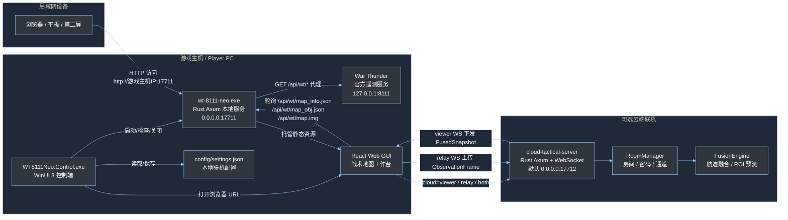
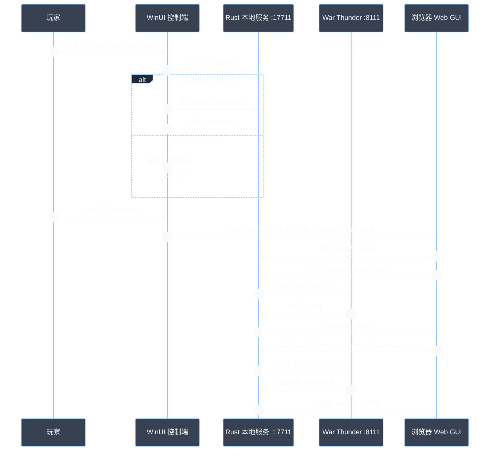
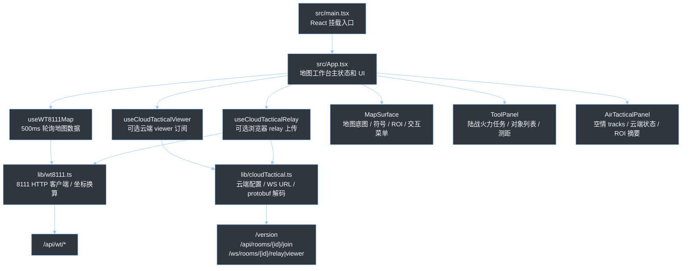
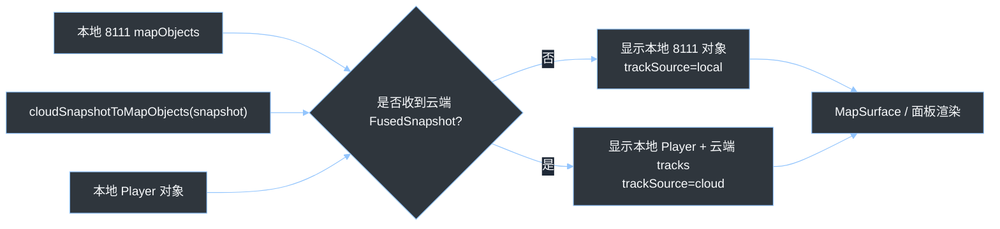
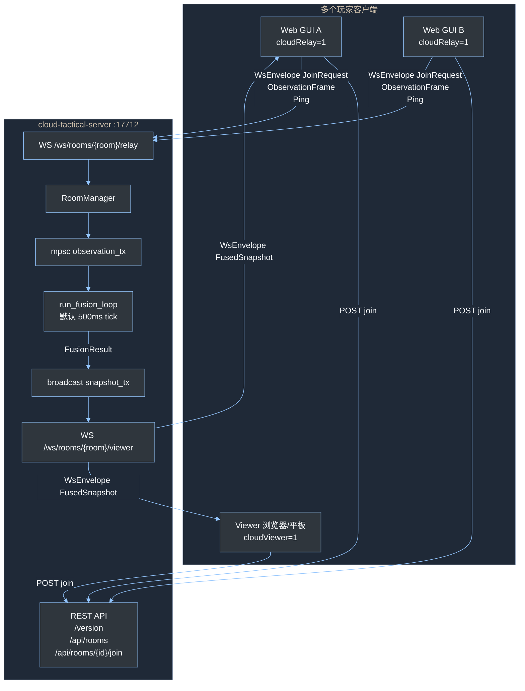
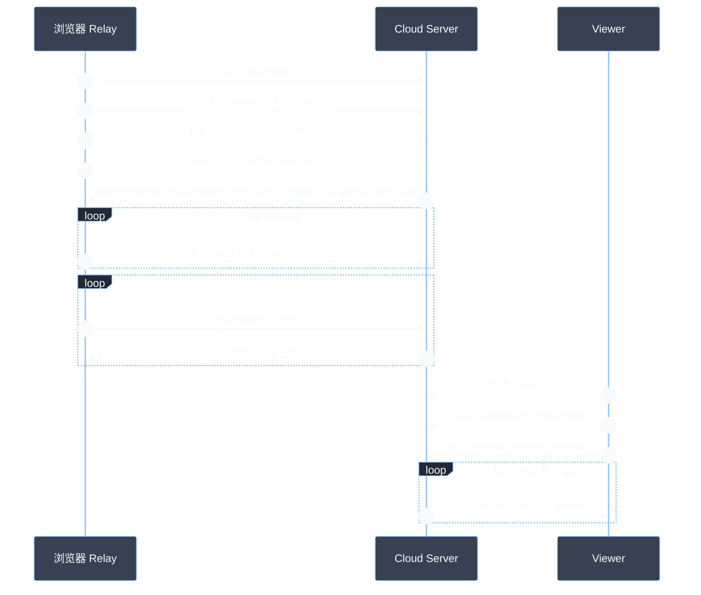
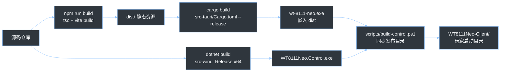

# WT 8111 Neo 当前原理结构描述图

最后更新：2026-06-02

本文基于当前仓库代码整理，描述 WT 8111 Neo 目前已经落地的运行结构、模块职责、数据流和协议边界。当前主线是基于 War Thunder 官方 `localhost:8111` 遥测数据的本地战术地图工作台，并已接入原型阶段的云端态势融合链路。

<style>
html,
body,
.vscode-body,
.markdown-body {
  color: #e5e7eb !important;
}

.markdown-body h1,
.markdown-body h2,
.markdown-body h3,
.markdown-body h4,
.markdown-body p,
.markdown-body li,
.markdown-body table,
.markdown-body th,
.markdown-body td,
.markdown-body blockquote,
.markdown-body strong {
  color: #e5e7eb !important;
}

.markdown-body a {
  color: #93c5fd !important;
}

.markdown-body code,
.markdown-body pre {
  color: #f8fafc !important;
  background: #111827 !important;
}

.markdown-body table,
.markdown-body th,
.markdown-body td {
  border-color: #64748b !important;
}

.mermaid,
.mermaid svg,
.mermaid text,
.mermaid span {
  color: #f8fafc !important;
  fill: #f8fafc !important;
}
</style>

## 1. 总体结构



当前玩家日常只需要启动 `WT8111Neo.Control.exe`。WinUI 控制端会确保本地 Rust 服务可用，Rust 服务再把 Web GUI 和 War Thunder `8111` 数据暴露到 `17711`，让本机浏览器或局域网设备访问。

## 2. 本地运行链路



关键点：

- `src-tauri/src/server.rs` 是本地 HTTP 服务主体，端口固定为 `17711`。
- `WT_BASE_URL` 固定指向 `http://127.0.0.1:8111`，避免局域网设备误访问自身的 `localhost:8111`。
- Web 静态资源来自构建后的 `dist`，通过 `rust-embed` 嵌入 Rust 服务 exe。
- 本地服务提供 `GET /api/health`、`GET /api/wt/map.img` 和 `GET /api/wt/{*path}`。
- 当前没有游戏内存读取、注入或 hook；数据来源限定在 War Thunder 官方本地 `8111` HTTP 接口。

## 3. Web GUI 模块结构



Web GUI 的当前数据选择逻辑：



当前 Web GUI 保留两套工作模式：

- Ground：本地地图对象、目标筛选、显隐、射手/目标选择、测距/方位、POI 跟踪。
- Air：优先展示云端融合航迹、敌友统计、最近敌机、云端 relay/viewer 状态和 ROI。

## 4. 云端联机链路



云端服务当前是内存态原型：

- `server.rs` 负责 REST 和 WebSocket 路由。
- `rooms.rs` 负责房间创建、查找、密码校验、观测队列和快照广播通道。
- `relay.rs` 处理 relay WebSocket，要求首包是 `JoinRequest`，之后接收 `ObservationFrame` 和 `Ping`。
- `fusion.rs` 把观测对象匹配成稳定 `trackId`，估算速度，并为消失的空中目标生成椭圆 ROI。
- `viewer.rs` 订阅房间快照广播，把 `FusionResult` 包装成 `FusedSnapshot` 下发。
- 默认云端端口是 `17712`，默认融合周期是 `500ms`。

## 5. 云端协议与数据转换

```mermaid
%%{init: {"theme":"base","themeVariables":{"background":"#2f363d","mainBkg":"#2f363d","primaryColor":"#374151","primaryBorderColor":"#93c5fd","primaryTextColor":"#f8fafc","secondaryColor":"#1e3a8a","tertiaryColor":"#334155","clusterBkg":"#1f2937","clusterBorder":"#94a3b8","lineColor":"#93c5fd","edgeLabelBackground":"#1f2937","textColor":"#f8fafc","fontFamily":"Arial, sans-serif"}}}%%
flowchart LR
  WTObj["WTMapObject<br/>x/y: 0..1<br/>icon/type/color"] --> Classify["客户端分类<br/>class_id / affiliation"]
  Classify --> Quantize["坐标量化<br/>0..1 -> 0..65535"]
  Quantize --> Obs["ObservationFrame<br/>ObservedObject[]"]
  Obs --> Envelope1["WsEnvelope<br/>payload=observation"]
  Envelope1 --> ServerDecode["服务端 prost 解码"]
  ServerDecode --> Fusion["TrackFingerprint<br/>affiliation + class + label + distance"]
  Fusion --> Track["FusedTrack<br/>track_id / confidence / velocity"]
  Fusion --> Roi["InterestRegion<br/>空中目标消失后 ROI"]
  Track --> Snapshot["FusedSnapshot"]
  Roi --> Snapshot
  Snapshot --> Envelope2["WsEnvelope<br/>payload=snapshot"]
  Envelope2 --> ClientDecode["前端手写 protobuf 解码"]
  ClientDecode --> MapObject["cloudSnapshotToMapObjects<br/>转换回 WTMapObject 形态"]
```



协议要点：

- WebSocket 二进制帧统一承载 `WsEnvelope`。
- schema 位于 `cloud-tactical-server/protos/*.proto`。
- Rust 服务端使用 `prost` 生成 `mod_pb.rs`。
- Web 前端没有使用生成代码，而是在 `src/lib/cloudTactical.ts` 中手写轻量 protobuf reader/writer。
- 坐标在云端协议中使用 `u16` 量化范围 `0..65535`，前端渲染时再归一化回 `0..1`。
- `JoinResponse` 和 `Ping/Pong` 提供服务端时间，用于浏览器 relay 估算 `clockOffsetMs`。

当前消息方向：



## 6. 端口、频率和配置

| 项目 | 当前值 | 来源 |
| --- | --- | --- |
| War Thunder 官方遥测 | `127.0.0.1:8111` | 游戏本地服务 |
| WT 8111 Neo 本地服务 | `0.0.0.0:17711` | `src-tauri/src/server.rs` |
| Cloud Tactical Server | `0.0.0.0:17712` | `cloud-tactical-server/src/config.rs` |
| Vite 开发服务 | `0.0.0.0:5173` | `package.json` |
| Web 地图轮询 | `500ms` | `useWT8111Map.ts` |
| Web 全量 8111 轮询 hook | `250ms` | `useWT8111.ts`，当前主界面未直接使用 |
| 浏览器 relay 上传 | `500ms` | `useCloudTacticalRelay.ts` |
| 浏览器 relay ping | `7000ms` | `useCloudTacticalRelay.ts` |
| 云端融合 tick | 默认 `500ms` | `ServerConfig.fusion_interval_ms` |
| 云端航迹历史 | 默认 `3s` | `ServerConfig.track_history_secs` |
| 云端 ROI TTL | 默认 `15s` | `ServerConfig.roi_ttl_secs` |

WinUI 配置文件：

```text
config/settings.json
```

当 Relay 配置启用且包含 `ServerUrl` 与 `RoomId` 时，控制端会打开类似 URL：

```text
http://127.0.0.1:17711?cloud=both&server=<cloud-server>&room=<room-id>&player=<name>&password=<password>
```

## 7. 构建与分发结构



发布目录的目标形态：

```text
WT8111Neo-Client/
  WT8111Neo.Control.exe
  wt-8111-neo.exe
  config/
    settings.json
```

`WT8111Neo.Control.exe` 是玩家手动启动入口；`wt-8111-neo.exe` 由控制端自动托管。

## 8. 当前边界和待注意点

```mermaid
%%{init: {"theme":"base","themeVariables":{"background":"#2f363d","mainBkg":"#2f363d","primaryColor":"#374151","primaryBorderColor":"#93c5fd","primaryTextColor":"#f8fafc","secondaryColor":"#1e3a8a","tertiaryColor":"#334155","clusterBkg":"#1f2937","clusterBorder":"#94a3b8","lineColor":"#93c5fd","edgeLabelBackground":"#1f2937","textColor":"#f8fafc","fontFamily":"Arial, sans-serif"}}}%%
flowchart TB
  Allowed["允许的数据来源"] --> WT8111["War Thunder 官方 8111 HTTP 数据"]
  Allowed --> UserConfig["用户在 WinUI 中保存的联机配置"]
  Allowed --> VisiblePixels["未来如恢复采集，只处理玩家屏幕可见像素"]

  Forbidden["明确不做"] --> Memory["读取游戏内存"]
  Forbidden --> Injection["进程注入"]
  Forbidden --> Hook["把 hook 作为首选方案"]
  Forbidden --> RawAllUpload["无约束上传完整原始数据"]

  CurrentLimit["当前实现限制"] --> BrowserRelay["relay 仍在浏览器页面内运行<br/>页面关闭即停止上传"]
  CurrentLimit --> InMemoryCloud["云端房间/航迹为内存态<br/>重启即丢失"]
  CurrentLimit --> ProtoManual["前端 protobuf 手写编解码<br/>需要与 proto 字段保持同步"]
  CurrentLimit --> WeakPassword["云端房间密码 hash 仍是原型实现<br/>不适合生产安全模型"]
```



后续如果继续推进联机能力，最自然的演进方向是把浏览器 relay 下沉到本地 Rust 服务或 WinUI 托管的后台进程中，让玩家即使关闭 Web GUI 也能持续上传 observation；同时把云端房间鉴权、持久化、TLS、限流和日志指标补齐。
